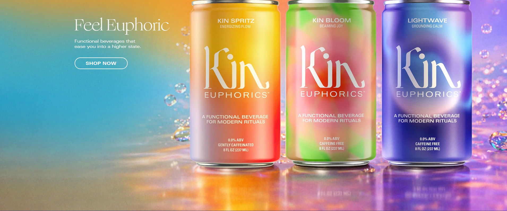

# Kin Euphorics

**Functional, non-alcoholic beverages** layered with adaptogens, nootropics, and botanics — built to help you feel euphoric, from dusk till dawn.  
Explore the full lineup: https://www.kineuphorics.com/

  

---

## What we make

Kin Euphorics is rooted in Ayurvedic-inspired functional ingredients that aim to support mood and daily rituals beyond basic flavor.

### Cans
- **Lightwave** — *Portal to Peace*
- **Kin Spritz** — *Invigorating Energizer*
- **Kin Bloom** — *Heart-Opening Joy*
- **Luna Morada**
- **Actual Sunshine**

### Made to Mix
- **Matchatini**
- **High Rhode**
- **Dream Light**

### Bundles
- Bundle Builder
- Variety Packs

> Want help choosing? Take the quiz: https://www.kineuphorics.com/pages/quiz

---

## Ingredient philosophy

We build “entourage-style” blends using:
- **Adaptogens** (stress-response support)
- **Nootropics** (cognition + neurotransmitter support)
- **Botanics** (taste + ritual + centering)

Learn more: https://www.kineuphorics.com/pages/about

---

## Find Kin near you

- Store locator: https://www.kineuphorics.com/pages/storelocator

---

## Recipes

A curated collection of non-alcoholic cocktails (“Kintails”):  
https://www.kineuphorics.com/blogs/recipes

---

## Press + reviews

- Reviews hub: https://www.kineuphorics.com/pages/reviews

---

## Contact

- Customer support / help center: https://www.kineuphorics.com/pages/help
- Wholesale inquiries: **sales@kineuphorics.com**

---

## Social

- Instagram: https://www.instagram.com/kineuphorics
- X (Twitter): https://twitter.com/kineuphorics
